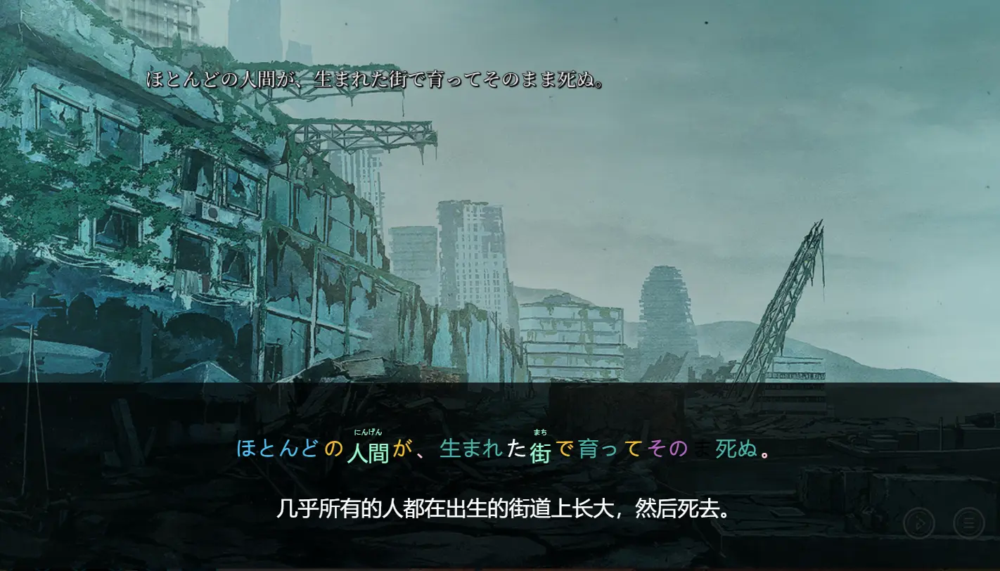

---
#### [简体中文](README.md)|[外部Api使用说明](TRANSLATIONAPI.md)|[翻译器先前配置](USERGUIDE.md)
> **YuKiGalGamePro**是一款以`electron`开发的日式视觉小说[ADV](https://en.wikipedia.org/wiki/Visual_novel)的是以学习日语的目的翻译器.
>
> 与其他翻译器不同的是
> YuKiGalGamePro连接了*AnKi* 和 *Redis*是以学习日语的目的翻译器
#### 新增功能💡
+ ✅ 移除原项目不能设置完全透明背景的诟病  
+ ✅ 新增tts和anki收录单词  
+ ✅ 弥补了原项目未实现的外部api调用  
+ ✅ 在打开mecab的情况下,可以对每个单词进行查看,只需要点击一下即可  

#### 说明文档📁
[点我进入](doc/说明文档.pdf)  
如果无法跳转,详见 doc/说明文档.pdf

<b>开发原因❓</b>

> 提到这个话题,内心**无比沉重**,市面上既然有了那么多的翻译器为什么还要做一个而且还要起名为**YuKiGalGamePro**?

* 😑 对于使用者:  
  游戏玩久了或许会说一些日语,但是普通教材又看不进去,只在学习**特色文化**的时候发现自己能学进去,无奈词语太多,记不住,学过就忘,为了加强记忆与纠正发音,因此做了这款翻译器

* 😗 对于开发者:  
  目前主流的翻译器采用python和c#进行开发,但是由于web从业者众多,对于很多新人小白来说使用vue进行开发好处众多,既加深了对于vue的了解为以后工作做了铺垫又体验到了开源的乐趣

* 😟 对于作者自身:
  1. Gal爱好者,之前对于这类作品一直付费,加上本身是学习web的纯纯小白一个,
  一次机会接触到了这个原项目[YuKiGalGame](https://github.com/project-yuki/YUKI),看着是使用vue进行开发的,所以准备自己研究研究但是一直再拖,当自己的技能有所增长的时候,发现这个项目已经没有人维护了.
  2. 本来是打算维护一下这个原项目,但是发现原项目过于老旧,而且对于原来的框架
  有很大的改进空间,于是对这个项目进行了一次重构,加进了很多自己的想法

#### 关于以后的发展
* 基本原则:永久免费
* 不会丢弃跑路,既然已经开源,同时也希望由更多的人加入到其中
* 目前只是初级版本,以后会添加更多的功能,大家可以把需求提出来，目前来说是支持日译简中，下个版本更新会有更多的选择，繁体中文肯定会添加的🍍
* 有问题请提交到<a href="https://github.com/zzxdt/YuKiGalGamePro/issues" style="color: green;">这里</a>

#### 在此感谢🙏
* [ ] [jooy2](https://github.com/jooy2/vutron)  
* [ ] [tinyAdapter](https://github.com/project-yuki/YUKI)

#### License
 Released under the MIT license.
