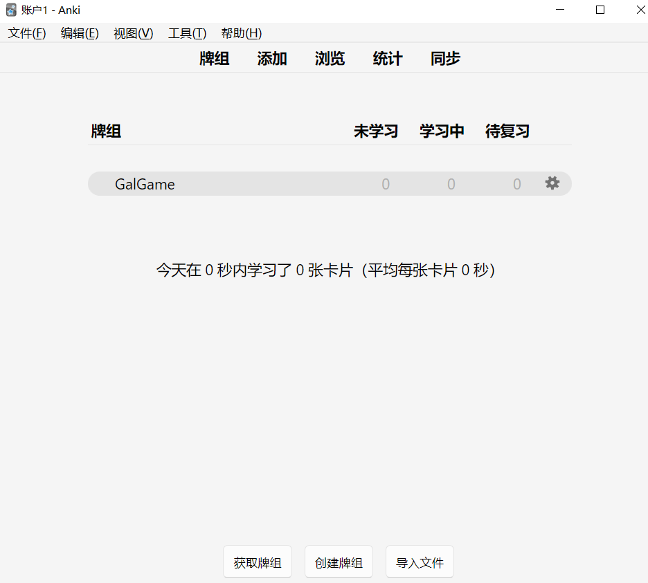
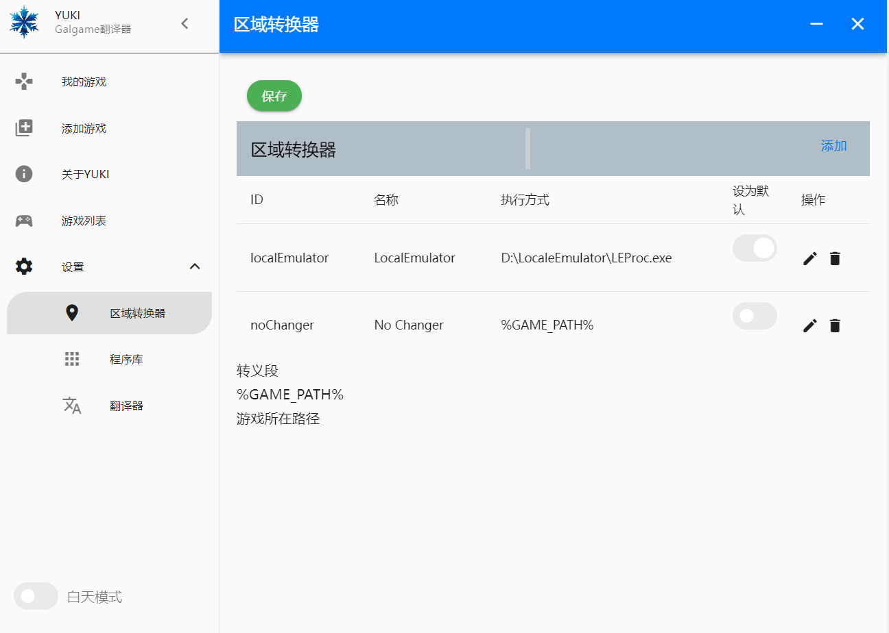

# 安装手册👓
## 安装所需的配置
> + ### 💡[AnKi](#AnKi配置)
> + ### 💡[Redis](#Redis配置)
> + ### 💡[Mecab](#Mecab配置)  
>
这些是基本配置,对于每个配置我都会进行讲解
##### 所有安装包的连接在这:<a href="https://github.com/zzxdt/yukigalgameproconfigeration/releases/tag/file" style="color: blue" >下载连接</a>
#### AnKi配置
#### 两种方法:
 + ✅.直接使用库中的包
 + 🤦‍♀️.手动配置  
****
> **AnKi版本要求**
> + 2.1.0-2.1.44 (Updated 2022-07-14)  
> * 2.1.45+ (Updated 2024-02-27)
****
> 1.打开anki→点击工具→插件 (Ctrol+Shift+A)→获取插件→输入:**2055492159**  
>新建模板名称为 **BaseG**或者其他名字,只要最后使用这个模板就行  
> 2.点击工具→管理笔记模板(Ctrol+Shift+N)→点击字段  
>****
> **配置如下:**
>   
> 其中对于text这个字段 要勾选，配置如下,然后保存
> ****
>
>****
>也是在管理笔记模板(Ctrol+Shift+N)页面下→点击卡片
```
> 1.正面内容模板
 <span style="font-size: 60px; ">
 <div class=jp> {{furigana:reading}}</div>
 <div class=text>{{text}}</div>
 <div class=audio>{{audioUrl}}</div>
 <hr id=answer>
```
```
 > 2.背面卡片内容
 <span style="font-size: 32px; ">
 <div class=jp></div>
 {{translation}}<br>
```
```
> 3.样式
 .card {
  font-family: arial;
  text-align: center;
  color: #4E342E;
  background-color: #A5D6A7;
  }
  .audio{
  font-size: 30px;
  text-align: center;
  color: #37474F;
  margin-top:15px;
  }
  .text{
  font-size: 50px;
  text-align: center;
  }
  .jp{
  font-size: 40px;
  text-align: center;
  }
```
> **卡片模板:**  
最好保持只有一个卡片模板！

>  
>****
>**最后一步**
>点击牌组→进入主页面→创建牌组  
> 名称必须为**GalGame**  
> 名称必须为**GalGame**  
> 名称必须为**GalGame**  
>重要的事情说3遍！
#### Mecab配置
##### 两种方法:
 + ✅.直接使用库中的包
 + 🤦‍♀️.自己下载
> <a href="https://taku910.github.io/mecab/" style="color: blue" >下载连接</a>  
> <a href="https://taku910.github.io/mecab/#install-windows" style="color: blue" >windows版本连接</a>  
****
> **选择这个:**
  
> ****
> 安装的时候语言选择一定要选择 **SHIFT-JIS**不要选择**UTF-8**  
>安装完成后验证一下 win+r 运行命令cmd输入**mecab**  
>如果发现命令框依旧让你继续输入,则说明安装成功
#### Redis配置
> + 🤦‍♀️最最最麻烦的配置,如果你是windows,请直接安装库中的包
> + 当然也可以下载windows版本的redis
>    +<a href="https://github.com/microsoftarchive/redis/releases/tag/win-3.0.504" style="color: blue" >下载连接</a>  
>****  
>👍如果你是开发者,勇士,请看这里  
>🍓<a href="https://learn.microsoft.com/en-us/windows/wsl/install-manual#step-4---download-the-linux-kernel-update-package" style="color: blue">详细文档点击这里</a>  
>+ 首先我们要确定windows版本, win10或者是win11
>因为win11内置wls2  
>+ 打开控制面板→程序→程序和功能→启用或关闭Windows功能。
找到并勾选 适用于Linux的Windows子系统，然后点击 确定。  
>
> 🤓win10系统，先看版本  
>x64版本至少需要是 **1903**  
>ARM64版本至少需要是**2004**
>+ win+r 以管理员身份运行cmd，  
>输入   **dism.exe/online/enable-feature/featurename:VirtualMachinePlatform /all
/norestart**  
>+ 下载并安装 WSL 2 Linux 内核更新包 <a href="https://learn.microsoft.com/en-us/windows/wsl/install-manual#step-4---download-the-linux-kernel-update-package" style="color: blue" >下载连接</a>  
>或者在cmd中(管理员身份)运行:  **wsl.exe --install**  
>+ 设置wsl2为默认 cmd输入:**wsl --set-default-version 2**  
>+ 下载任意linux(我这里的是ubantu)   
cmd输入:**wsl --install -d Ubuntu-20.04(或者其他版本)**  
>+ 下载docker windows版本  <a href="https://www.docker.com/products/docker-desktop/" style="color: blue" >下载连接</a>   
>点击设置 就是齿轮标志  
>在左侧General 查看wsl2是否设置  
>+ 同样的cmd 检查docker是否存在  
>输入: **docker –version**  
>+ 然后安装 redis:  
>以管理员身份运行cmd,  
输入:**docker run --name my-redis -p 6379:6379 -d redis**  
>+ 最后测试redis  
>cmd输入: **redis-cli**
>+ 🎩Redis端口号一定要是:6379
#### win11
直接安装docker windows版本即可,然后直接配置

# 翻译器介绍
> 1. 先别直接启动，首先先自己的翻译api，如果没有的话请申请  
>⚱️+ <a href="https://api.fanyi.baidu.com/" style="color: blue" >百度翻译申请</a>  
>⚱️+ <a href="https://ai.youdao.com/console/#/app-overview"
style="color: red" >有道翻译申请</a>  
>然后打开**/resources/translateApi/OpenBaidu.js和YouDaoApi.js**  
填写好对应的**密钥**和**id**  
> 2.**(可选)(如果配置转区工具需要管理员身份运行!翻译器内部可更改！)**   
配置default.json  
>在这里你需要下载一个转区工具  
><a href="https://github.com/xupefei/Locale-Emulator/releases/tag/v2.5.0.1"
style="color: red" >点击跳转</a>  
下载zip后进行安装,安装的路径别放在c盘
> 3. 启动anki 按照上述配置好了如下  
  

> 4. 打开cmd 输入redis-cli检查redis是否接入,这是接入好的样子

> 5.打开软件

点击这个笔把LEProce.exe添加进去,重启软件,打开时**右击以管理员身份运行**

> 5. 和原yuki一样可以从进程直接启动,也可以添加游戏启动  
> 
>添加游戏成功,在游戏列表中启动，选中转区工具然后点击上方的保存,然后就可以直接运行游戏了!
>

#### 对于设置字体以及背景颜色,以及控制文本暂停翻译,在启动游戏后的翻译窗口，设置完成后请点击，锁头标志右面的摁扭保存，在跳转至翻译界面即可！

